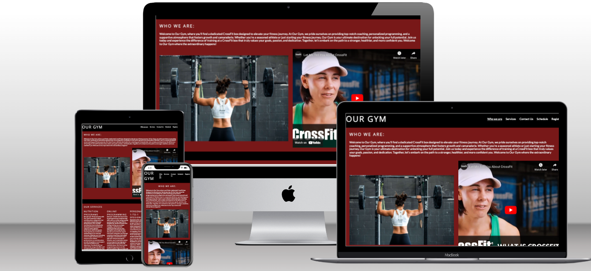

# Our Gym 

Our Gym is a crossfit gym that offers a range of services to help you achieve your fitness goals. Whether you're looking to get fit, lose weight, or build muscle, we have the tools and expertise to help you succeed. Our gym provides multiple services, including group sessions, online programming, and nutrition advice. This documentation will provide an overview of Our Gym's services and features.

## Features 

### Site wide 

* Navigation links: 
    * Contains navigation links to Who we are, Services, Schedule, Register and Contact Us sections.
    * Easier for user to jump to sections quickly.
    

* Footer: 
    * Access the gym page on social media websites such as Facebook and instagram.
  

* Favicon: 
    * Used a dumbbell logo as the gym logo that will appear to the user when in the browser tab
    

### Landing page 
* The website landing page is divided into 5 sections
    * Section 1 (Who we are): This section gives a breif on our gym facility and what we offer and contains a video explaining the crossfit sport.
    * Section 2 (Our services): This section gives a brief on what services we offer so customers can choose from these services the one suits his needs.
    * Section 3 (Schedule): This section contains our schedule  with different class times
    * Section 4 (Contact Us): This section contains a form so customer can use if they have a specific question or concern
    * Section 5 (Sign Up): This section for customers who want to sign up for a class

 ### Existing Features 
 * Responsive design
 * Iframes to include video introductory to the sport
 * Contact form for specifc questions or comments
 * Sign up form to choose between classes
 * Success pages for the sign up and the contact us

 ### Features left to Implement 
 * Adding some animation to the website using Java Script
 * The contact form and the sign up form will be saving the customer information in a database using JavaScript
 * 404 page to be added later

## Technologies 
* HTML
    * The structure of the Website was developed using HTML as the main language.
* CSS
    * The Website was styled using custom CSS in an external file.
* Visual Studio Code
    * The website was developed using Visual Studio Code IDE
* GitHub
    * Source code is hosted on GitHub and delpoyed using Git Pages.
* Git
    * Used to commit and push code during the development opf the Website
* Tinyjpg
    * https://tinyjpg.com/ was used to reduce the size of the images used throughout the website
* favicon.io
    * favicon files were created 
* pexels.com
    * https://www.pexels.com/ was used to get the images for my website        

 ## Testing 
 ### Responsiveness 
The pages underwent testing to ensure they were responsive across various screen sizes starting from 320px and above. The testing was performed on Chrome, Edge, Firefox, and Opera browsers.

Steps to test:
1. Open browser and navigate to [Our Gym](https://8000-moabdelbasset-project1-lqc2vxzvogh.ws-eu94.gitpod.io/)
2. Open the developer tools (right click and inspect)
3. Decrease the screen width to 320px
4. Set the zoom to 50%
5. Click and drag the responsive window to maximum width

Expected:
Website is responsive on all screen sizes and no images are pixelated or stretched.
No horizontal scroll is present.
No elements overlap.

Actual:
Website was responsive on all screen sizes and no image was pixelated or stretched.
Horizontal scroll was present because of the schedule section.
Tested on Iphone 12 and Samsung Galaxy S8.

## Accessibility

[Wave Accessibility](https://wave.webaim.org/) tool was used throughout development and for final testing of the deployed website to check for any aid accessibility testing.

Testing was focused to ensure the following criteria were met:

- All forms have associated labels or aria-labels so that this is read out on a screen reader to users who tab to form inputs
- Color contrasts meet a minimum ratio as specified in [WCAG 2.1 Contrast Guidelines](https://www.w3.org/WAI/WCAG21/Understanding/contrast-minimum.html)
- Heading levels are not missed or skipped to ensure the importance of content is relayed correctly to the end user
- All content is contained within landmarks to ensure ease of use for assistive technology, allowing the user to navigate by page regions
- All not textual content had alternative text or titles so descriptions are read out to screen readers
- HTML page lang attribute has been set
- Aria properties have been implemented correctly
- WCAG 2.1 Coding best practices being followed

[W3C Validator](https://validator.w3.org/nu/?doc=https%3A%2F%2F8000-moabdelbasset-project1-lqc2vxzvogh.ws-eu94.gitpod.io%2F) too was used to check the html and CSS and found no errors

           
   